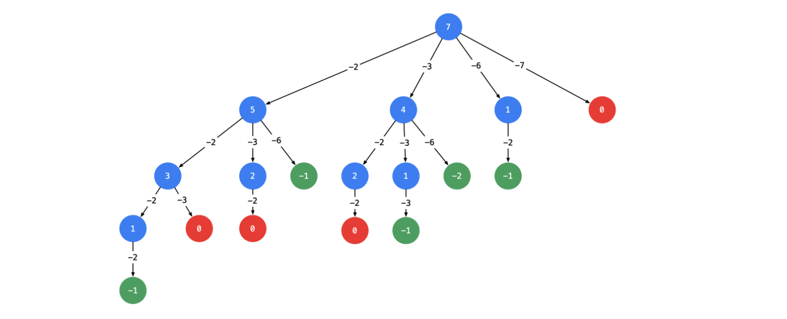
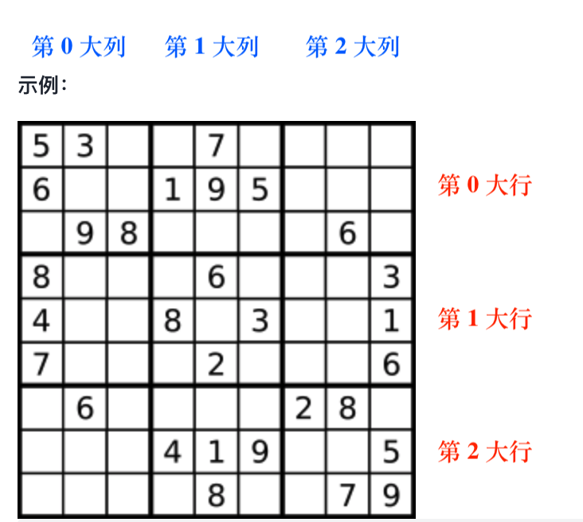
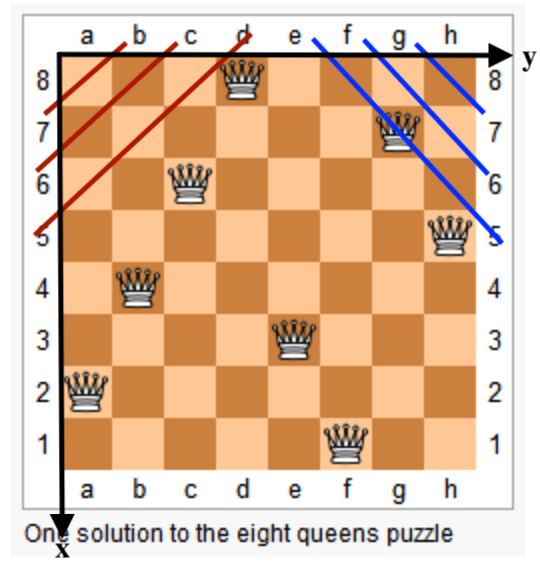

# DFS 回溯法
[2151. 基于陈述统计最多好人数](https://leetcode-cn.com/problems/maximum-good-people-based-on-statements/submissions/)

```Java
import java.util.Arrays;

class Solution {
    private static int n;
    private static int res;

    public int maximumGood(int[][] statements) {
        n = statements.length;
        res = 0;

        int[] path = new int[n];
        Arrays.fill(path, 2);
        dfs(statements, path, 0);
        return res;
    }

    // 搜索第 u 个位置, path[u] 是前面的好人对 u 的论断
    private static void dfs(int[][] statements, int[] path, int u) {
        // 这里为什么使用 pathCopy 呢，因为 dfs 完成后需要恢复现场，用pathCopy 可以不改变 path 本身，免去恢复现场这个步骤
        int[] pathCopy = Arrays.copyOf(path, path.length);
        if (u == n) {
            res = Math.max(res, numOfGood(pathCopy));
            return;
        }
        if (pathCopy[u] == 0) {
            // 坏人的论断不用管
            dfs(statements, pathCopy, u + 1);
        } else if (pathCopy[u] == 1) {
            // 需要判断该好人的论断是否与前面的好人的论断有矛盾
            for (int j = 0; j < n; j++) {
                if (statements[u][j] != 2 && pathCopy[j] != 2 && statements[u][j] != pathCopy[j]) return;
                if (statements[u][j] != 2 && pathCopy[j] == 2) pathCopy[j] = statements[u][j];
            }
            dfs(statements, pathCopy, u + 1);
        } else { // path[u] == 2
            // 他可以是好人
            pathCopy[u] = 1;
            dfs(statements, pathCopy, u);
            // 也可以是坏人
            pathCopy[u] = 0;
            dfs(statements, pathCopy, u + 1);
        }
    }

    private static int numOfGood(int[] path) {
        int cnt = 0;
        for (int j = 0; j < n; j++) {
            if (path[j] == 1) cnt++;
        }
        return cnt;
    }
}
```
- 回溯法一条路走到头后是一定要恢复进入该层 dfs 函数之前的状态的，本题目在原 path 数组上面恢复非常困难，所以直接 copy 一个新的 path，这样就可以避免这个问题。

## 组合
[77.组合](https://leetcode-cn.com/problems/combinations/)

```Java
class Solution {
    private final static int N = 25;
    private final static boolean[] st = new boolean[N];

    private static int nn, kk;

    private final static List<List<Integer>> res = new ArrayList<>();

    public List<List<Integer>> combine(int n, int k) {
        nn = n;
        kk = k;
        res.clear();

        List<Integer> path = new ArrayList<>();
        dfs(0, path, 0);
        return res;
    }
    private static void dfs(int u, List<Integer> path, int pre) {
        if (u == kk) {
            res.add(new ArrayList<>(path));
        }
        for (int i = pre + 1; i <= nn; i++) {
            if (!st[i]) {
                st[i] = true;
                path.add(i);
                dfs(u + 1, path, i);
                path.remove(path.size() - 1);
                st[i] = false;
            }
        }
    }
}
```

[17. 电话号码的字母组合](https://leetcode-cn.com/problems/letter-combinations-of-a-phone-number/)
```Java
class Solution {
    private final static Map<Character, char[]> m = new HashMap<>();
    private static String s;
    private static int n;
    public List<String> letterCombinations(String digits) {
        List<String> res = new ArrayList<>();
        if (digits == null || "".equals(digits)) return res;
        initMap();
        n = digits.length();
        s = digits;

        StringBuilder path = new StringBuilder();
        dfs(0, path, res);
        return res;
    }
    private static void dfs(int u, StringBuilder path, List<String> res) {
        if (u == n) {
            res.add(path.toString());
            return;
        }
        for (char c: m.get(s.charAt(u))) {
            path.append(c);
            dfs(u + 1, path, res);
            path.deleteCharAt(path.length() - 1);
        }

    }
    private static void initMap() {
        m.put('2', new char[]{'a', 'b', 'c'});
        m.put('3', new char[]{'d', 'e', 'f'});
        m.put('4', new char[]{'g', 'h', 'i'});
        m.put('5', new char[]{'j', 'k', 'l'});
        m.put('6', new char[]{'m', 'n', 'o'});
        m.put('7', new char[]{'p', 'q', 'r', 's'});
        m.put('8', new char[]{'t', 'u', 'v'});
        m.put('9', new char[]{'w', 'x', 'y', 'z'});
    }
}
```

[39. 组合总和](https://leetcode-cn.com/problems/combination-sum/)



```Java
import java.io.*;
import java.util.*;
class Solution {
    private static int[] can;
    public List<List<Integer>> combinationSum(int[] candidates, int target) {
        List<List<Integer>> res = new ArrayList<>();
        Arrays.sort(candidates);
        if (target < candidates[0]) return res;

        can = candidates;
        List<Integer> path = new ArrayList<>();
        dfs(res, path, target, 0);

        return res;
    }
    private static void dfs(List<List<Integer>> res, List<Integer> path, int remain, int begin) {
        if (remain == 0) {
            res.add(new ArrayList<>(path));
        }
        // 设置 begin 避免重复
        for (int i = begin; i < can.length; i++) {
            if (remain >= can[i]) {
                path.add(can[i]);
                dfs(res, path, remain - can[i], i);
                path.remove(path.size() - 1);
            }
        }
    }
}
```

[组合总和II](https://leetcode-cn.com/problems/combination-sum-ii/)

```Java
class Solution {
    private static int[] can;
    public List<List<Integer>> combinationSum2(int[] candidates, int target) {
        Arrays.sort(candidates);
        can = candidates;

        List<List<Integer>> res = new ArrayList<>();
        List<Integer> path = new ArrayList<>();

        dfs(res, path, target, 0);
        return res;
    }
    private static void dfs(List<List<Integer>> res, List<Integer> path, int remain, int begin) {
        if (remain == 0) {
            res.add(new ArrayList<>(path));
        }

        for (int i = begin; i < can.length; i++) {
            if (i > begin && can[i] == can[i - 1]) continue; // 去重
            if (remain - can[i] >= 0) {
                path.add(can[i]);
                dfs(res, path, remain - can[i], i + 1);
                path.remove(path.size() - 1);
            }
        }
    }
    // private static int findNext(int i) {
    //     for (int j = i + 1; j < can.length; j++) {
    //         if (can[j] != can[j - 1]) return j;
    //     }
    //     return can.length;
    // }
}
```

[组合总和 III](https://leetcode-cn.com/problems/combination-sum-iii/)
```Java
class Solution {
    private static int kk;
    public List<List<Integer>> combinationSum3(int k, int n) {
        List<List<Integer>> res = new ArrayList<>();
        List<Integer> path = new ArrayList<>();

        kk = k;

        dfs(res, path, n, 0, 1);
        return res;
    }
    // u 记录当前该为哪个位置添加元素了
    private static void dfs(List<List<Integer>> res, List<Integer> path, int remain, int u, int begin) {
        if (u == kk && remain == 0) {
            res.add(new ArrayList<>(path));
        }

        if (u > kk) return;
        
        for (int i = begin; i <= 9; i++) {
            if (remain - i >= 0) {
                path.add(i);
                dfs(res, path, remain - i, u + 1, i + 1);
                path.remove(path.size() - 1);
            }
        }
    }
}
```

## 分割
[131. 分割回文串](https://leetcode-cn.com/problems/palindrome-partitioning/)
```Java
class Solution {
    public List<List<String>> partition(String s) {
        List<List<String>> res = new ArrayList<>();
        List<String> path = new ArrayList<>();
        dfs(res, path, s);
        return res;
    }
    // path 记录了分割点
    private static void dfs(List<List<String>> res, List<String> path, String remain) {
        if (remain.length() == 0) {
            res.add(new ArrayList<>(path));
        }

        for (int i = 1; i <= remain.length(); i++) {
            String now = remain.substring(0, i);
            if (isPalindrome(now)) {
                path.add(now);
                dfs(res, path, remain.substring(i));
                path.remove(path.size() - 1);
            } 
        }
    }
    private static boolean isPalindrome(String s) {
        if (s.length() == 1) return true;
        int i = 0, j = s.length() - 1;
        while (i < j) {
            if (s.charAt(i) != s.charAt(j)) return false;
            i++;
            j--;
        }
        return true;
    }
}
```

[93. 复原 ip 地址](https://leetcode-cn.com/problems/restore-ip-addresses/)

```Java
class Solution {
    public List<String> restoreIpAddresses(String s) {
        List<String> res = new ArrayList<>();
        List<Integer> path = new ArrayList<>();

        dfs(res, path, s, 0);
        return res;
    }

    private static void dfs(List<String> res, List<Integer> path, String remain, int u) {
        if (u == 4 && remain.length() == 0) {
            res.add(concat(path));
            return;
        }
        if (u >= 4) return;
        for (int i = 1; i <= Math.min(remain.length(), 3); i++) {
            String now = remain.substring(0, i);
            int nowInt = Integer.parseInt(now);
            if ((now.length() == 1 && nowInt == 0) || (now.charAt(0) != '0' && nowInt > 0 && nowInt <= 255)) {
                path.add(nowInt);
                dfs(res, path, remain.substring(i), u + 1);
                path.remove(path.size() - 1);
            } 
        }
    }
    private static String concat(List<Integer> path) {
        StringBuilder sb = new StringBuilder();
        for (int i = 0; i < path.size(); i++) {
            if (i != path.size() - 1) {
                sb.append(path.get(i) + ".");
            } else {
                sb.append(path.get(i));
            }
        }
        return sb.toString();
    } 
}
```

## 子集
[78. 子集](https://leetcode-cn.com/problems/subsets/submissions/)
```Java
class Solution {
    public List<List<Integer>> subsets(int[] nums) {
        List<List<Integer>> res = new ArrayList<>();
        List<Integer> path = new ArrayList<>();
        dfs(res, path, nums, 0);
        return res;
    }
    private static void dfs(List<List<Integer>> res , List<Integer> path, int[] nums, int begin) {
        res.add(new ArrayList<>(path));
        for (int i = begin; i < nums.length; i++) {
            path.add(nums[i]);
            dfs(res, path, nums, i + 1);
            path.remove(path.size() - 1);
        }
    }
}
```

[90. 子集II](https://leetcode-cn.com/problems/subsets-ii/)
```Java
class Solution {
    public List<List<Integer>> subsetsWithDup(int[] nums) {
        List<List<Integer>> res = new ArrayList<>();
        List<Integer> path = new ArrayList<>();
        Arrays.sort(nums); // 需要去重的时候必须有序
        dfs(res, path, nums, 0);
        return res;
    }
    private static void dfs(List<List<Integer>> res , List<Integer> path, int[] nums, int begin) {
        res.add(new ArrayList<>(path));
        for (int i = begin; i < nums.length; i++) {
            if (i > begin && nums[i] == nums[i - 1]) continue; // 经典去重语句
            path.add(nums[i]);
            dfs(res, path, nums, i + 1);
            path.remove(path.size() - 1);
        }
    }
}
```

[46. 全排列](https://leetcode-cn.com/problems/permutations/submissions/)
```Java
class Solution {
    public List<List<Integer>> permute(int[] nums) {
        List<List<Integer>> res = new ArrayList<>();
        List<Integer> path = new ArrayList<>(); 
        boolean[] st = new boolean[nums.length];

        dfs(res, path, nums, st, 0);
        return res;
    }
    private static void dfs(List<List<Integer>> res, List<Integer> path, int[] nums, boolean[] st, int u) {
        if (u == nums.length) {
            res.add(new ArrayList<>(path));
            return;
        }
        for (int i = 0; i < nums.length; i++) {
            if (!st[i]) {
                st[i] = true;
                path.add(nums[i]);
                dfs(res, path, nums, st, u + 1);
                path.remove(path.size() - 1);
                st[i] = false;
            }
        }
    } 
}
```

[47.全排列II](https://leetcode-cn.com/problems/permutations-ii/submissions/)
```Java
class Solution {
    public List<List<Integer>> permuteUnique(int[] nums) {
        List<List<Integer>> res = new ArrayList<>();
        List<Integer> path = new ArrayList<>();
        boolean[] st = new boolean[nums.length];
        Arrays.sort(nums);

        dfs(res, path, st, nums, 0);
        return res;
    }
    private static void dfs(List<List<Integer>> res, List<Integer> path, boolean[] st, int[] nums, int u) {
        if (u == nums.length) {
            res.add(new ArrayList<>(path));
            return;
        }
        for (int i = 0; i < nums.length; i++) {
            if (!st[i]) {
                if (i > 0 && nums[i] == nums[i - 1] && !st[i - 1]) continue; // 注意这里去重的时候和子集的区别

                st[i] = true;
                path.add(nums[i]);
                dfs(res, path, st, nums, u + 1);
                path.remove(path.size() - 1);
                st[i] = false;
            }
        }
    }
}
```
## 棋盘
[37. 解数独](https://leetcode-cn.com/problems/sudoku-solver/)
```Java
import java.util.ArrayList;
import java.util.List;

class Solution {
    private int[] row = new int[9], col = new int[9];
    private int[][] block = new int[3][3];

    public void solveSudoku(char[][] board) {
        int cnt = 0;
        for (int i = 0; i < 9; i++) {
            for (int j = 0; j < 9; j++) {
                if (board[i][j] == '.') cnt++;
                else fill(i, j, board[i][j] - '1', true);
            }
        }
        int[] pos = findNextPos(board, 0);
        dfs(board, cnt, pos[0], pos[1]);
    }
    // dfs 这里带布尔值返回值, 原因是搜到 true 后一路绿灯，不需要再执行撤销语句了
    private boolean dfs(char[][] board, int cnt, int x, int y) {
        if (cnt == 0) return true;

        List<Integer> candidates = findCandidates(x, y);
        if (candidates.isEmpty()) return false;

        for (int val : candidates) {
            fill(x, y, val, true);
            board[x][y] = (char) (49 + val);

            int[] pos = findNextPos(board, x);

            boolean flag = dfs(board, cnt - 1, pos[0], pos[1]);
            if (flag) return true;

            board[x][y] = '.';
            fill(x, y, val, false);
        }
        // 搜索完一支后还没有出现 true 说明当前支没有找到答案，返回 false
        return false;
    }

    private void fill(int x, int y, int val, boolean flag) {
        row[x] = flag ? row[x] | (1 << val) : row[x] ^ (1 << val);
        col[y] = flag ? col[y] | (1 << val) : col[y] ^ (1 << val);
        block[x / 3][y / 3] = flag ? block[x / 3][y / 3] | (1 << val) : block[x / 3][y / 3] ^ (1 << val);
    }

    private List<Integer> findCandidates(int x, int y) {
        int mask = row[x] | col[y] | block[x / 3][y / 3];
        List<Integer> l = new ArrayList<>();
        for (int i = 0; i < 9; i++) {
            if (((mask >> i) & 1) == 0) l.add(i);
        }
        return l;
    }

    private int[] findNextPos(char[][] board, int x) {
        for (int i = x; i < 9; i++) {
            for (int j = 0; j < 9; j++) {
                if (board[i][j] == '.') return new int[]{i, j};
            }
        }
        return new int[]{-1, -1};
    }
}

```

- 这个题目非常巧妙的使用了二进制优化，将 1 ~ 9 的数字表示成 $2^j$ 的形式。
- row[i] 中存的是第 $i$ 行所有数的**二进制**表示的和。
    - 如实例中第一行有 5，3，7，那么 $\text{row[0]} = 2^4 + 2^2 + 2^6 = 84$，二进制形式为 1010100。
    - 如此的好处在于方便的表示**当前行哪些数字已经选了**。
- 同理: col[i] 中存的是第 $i$ 列所有数的**二进制**表示的和；block[i][j] 中存的是**第 i 大行，j 大列**的**宫内**的所有数的**二进制**表示的和。



- fill 函数:
    - ```Java row[x] | (1 << val) ``` (val = 0, 1, 2 ... 8) 表示将 row[x] 的 val 位变成 1。
    - ```Java row[x] ^ (1 << val) ``` 表示将 row[x] 的 val 位变成 0。
    - 如此实现了 dfs 中需要的 **添加** 和 **撤销** 操作。

- findCandidates 函数:
    - ```Java int mask = row[x] | col[y] | block[x / 3][y / 3];``` 这句话的意思就是将该位置的**行，列，还有宫内**已经存在的元素筛选出来。其中如果某个位置为 0， 就意味着当前位置所对应的元素还可以作为 candidates 进行搜索。
- 更进一步的优化，还可以每次选择**限制最多的格子**进行填数，减少试错成本。

[51. n皇后](https://leetcode-cn.com/problems/n-queens/)
```Java
class Solution {
    // col[i] 表示第 i 列是否被选中， dg[i] 表示第 i 个对角线是否被选中， udg[i] 表示第 i 个反对角线是否被选中
    private boolean[] col, dg, udg;
    private int nn;
    public List<List<String>> solveNQueens(int n) {
        nn = n;
        col = new boolean[n];
        dg = new boolean[2 * n];
        udg = new boolean[2 * n];

        List<List<String>> res = new ArrayList<>();
        List<Integer> path = new ArrayList<>();
        dfs(res, path, 0);
        return res;
    }
    private void dfs(List<List<String>> res, List<Integer> path, int u) {
        if (u == nn) {
            res.add(generateBoard(path));
            return;
        }
        for (int i = 0; i < nn; i++) {
            if (!col[i] && !dg[nn + i - u] && !udg[i + u]) {
                col[i] = dg[nn + i - u] = udg[i + u] = true;
                path.add(i);
                dfs(res, path, u + 1);
                path.remove(path.size() - 1);
                col[i] = dg[nn + i - u] = udg[i + u] = false;
            }
        }
    }

    private List<String> generateBoard(List<Integer> path) {
        List<String> res = new ArrayList<>();
        StringBuilder sb;
        for (int col : path) {
            sb = new StringBuilder();
            for (int j = 0; j < nn; j++) {
                if (j == col) sb.append('Q');
                else sb.append('.');
            }
            res.add(sb.toString());
        }
        return res;
    }

}
```


- 思路: 类似全排列，我们有 n 个位置(编号为 0 ～ n - 1)。 **每个位置代表一行**，我们需要**为每一个位置选择一个列**。如此可以保证任意两个皇后不在同一行，同一列。进一步，为了保证任意两个皇后不在同一对角线上，我们需要维持 $\color{red} dg$ 以及 $\color{blue} udg$。当行号 u, 列号 i 确定后，由于红色线的方程是 $i = -u + b$, 我们得到 $b = i + u$，即为 $\color{red} dg$ 的序号；蓝色线的方程是 $i = u + b$, 为了避免序号为负，我们得到 $\color{blue} udg$ 的序号为 $b = i - u + n$。

