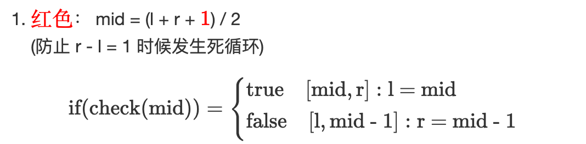
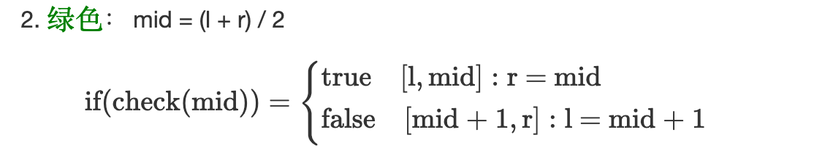

# 模版



```Java
// 查找元素 k 的终止位置，array[l~该位置] 的元素都满足 <= k
private static int binarySearch2(int[] array, int target) {
    int l = 0, r = array.length - 1;
    while (l < r) {
        int mid = (l + r + 1) >> 1;
        if (array[mid] <= target) l = mid; // 此处为 l = mid 时候，上面要加 1
        else r = mid - 1;
    }
    return l;
}
```


```Java
// 查找元素 k 的起始位置，array[该位置 ~ r] 的元素都满足 >= k
private static int binarySearch1(int[] array, int target) {
    int l = 0, r = array.length - 1;
    while (l < r) {
        int mid = (l + r) >> 1;
        if (array[mid] >= target) r = mid;
        else l = mid + 1;
    }
    return l;
}
```
- 题目可能无解，但二分一定有解。

# 题目
[704. 二分查找](https://leetcode-cn.com/problems/binary-search/)
```Java
class Solution {
    public int search(int[] nums, int target) {
        int l = 0, r = nums.length - 1;
        while (l < r) {
            int mid = (l + r + 1) / 2;
            if (nums[mid] <= target) l = mid;
            else r = mid - 1;
        }

        if (nums[l] == target) return l;
        else return -1;
    }
}
```
- 可以发现左边的元素都满足 <= target, 我们所要找的 target 就是**左半区间的最右边元素**。所以用模版一即可。
- 最后检查左半区间最右边元素是否为 target，如果不是 target 说明 target 不存在。

[35. 搜索插入位置](https://leetcode-cn.com/problems/search-insert-position/)
```Java
class Solution {
    public int searchInsert(int[] nums, int target) {
        if (target > nums[nums.length - 1]) return nums.length;
        int l = 0, r = nums.length - 1;
        while (l < r) {
            int mid = (l + r) / 2;
            if (nums[mid] >= target) r = mid;
            else l = mid + 1;
        }
        return l;
    }
}
```

- 使用模版的时候要保证**解一定在合法的数组下标**中。
    - 输入: nums = [1,3,5,6], target = 7
    输出: 4 
    这个样例最终的答案不在合法的数组下标中，所以需要提前排除。
- 对于本题的插入位置，我们可以发现这个**插入位置及其右边的元素都满足 >= target**，所以使用模版二即可。

[34. 在排序数组中查找元素的第一个和最后一个位置](https://leetcode-cn.com/problems/find-first-and-last-position-of-element-in-sorted-array/)

```Java
class Solution {
    public int[] searchRange(int[] nums, int target) {
        if (nums.length == 0) return new int[]{-1, -1};
        int l = 0, r = nums.length - 1;
        while (l < r) {
            int mid = (l + r) / 2;
            if (nums[mid] >= target) r = mid;
            else l = mid + 1;
        }
        int left = l;
        l = 0;
        r = nums.length - 1;
        while (l < r) {
            int mid = (l + r + 1) / 2;
            if (nums[mid] <= target) l = mid;
            else r = mid - 1;
        }
        int right = l;
        if (nums[left] == target && nums[right] == target) return new int[]{left, right};
        else return new int[]{-1, -1};
    }
}
```
- 查找第一个位置，可以发现该位置满足其右边的元素都 >= target, 所以使用模版二。
- 查找最后一个位置，可以发现该位置满足其左边的元素都 <= target, 所以使用模版一。
