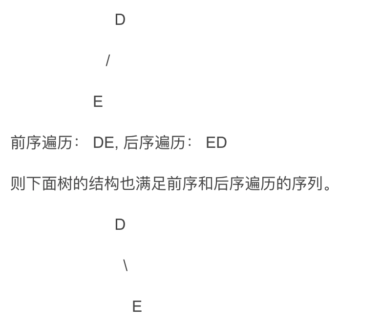
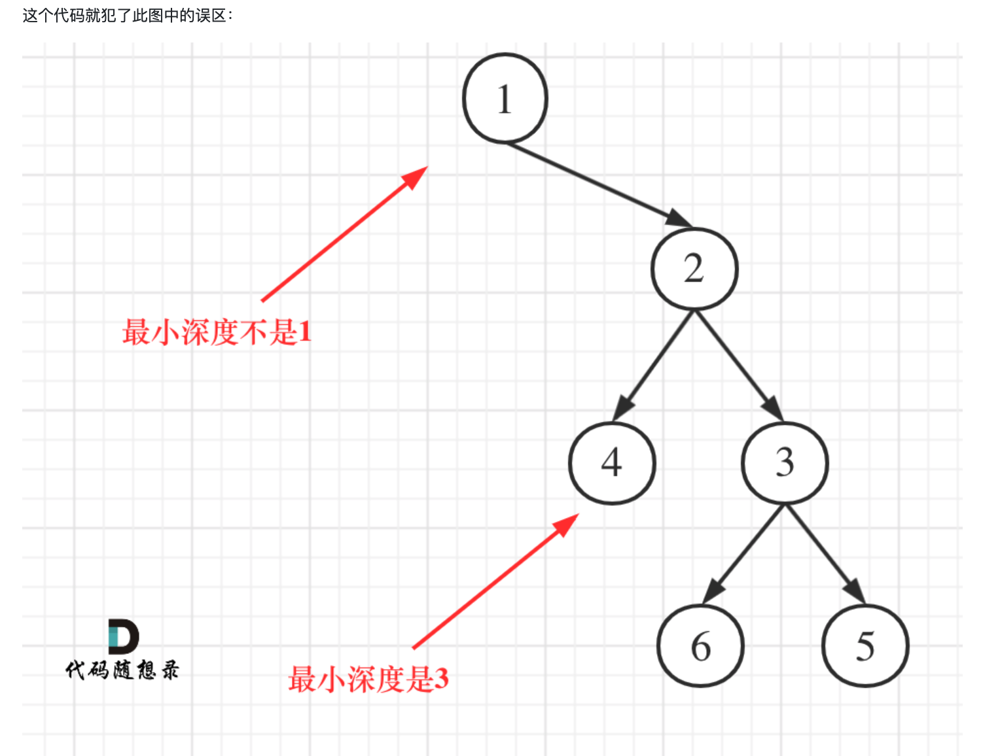

# 二叉树定义
```Java
public class TreeNode {
    int val;
    TreeNode left;
    TreeNode right;
    TreeNode() {}
    TreeNode(int val) { this.val = val; }
    TreeNode(int val, TreeNode left, TreeNode right) {
        this.val = val;
        this.left = left;
        this.right = right;
    }
}
```

# 二叉树的遍历方式
[144. 二叉树的前序遍历](https://leetcode-cn.com/problems/binary-tree-preorder-traversal/submissions/)

```Java
class Solution {
    public List<Integer> preorderTraversal(TreeNode root) {
        if (root == null) return new ArrayList<>();
        List<Integer> ans = new ArrayList<>();
        traverse(root, ans);
        return ans;
    }
    private void traverse(TreeNode root, List<Integer> ans) {
        if (root == null) return;
        ans.add(root.val);
        traverse(root.left, ans);
        traverse(root.right, ans);
    }
}

class Solution {
    public List<Integer> preorderTraversal(TreeNode root) {
        if (root == null) return new ArrayList<>();
        List<Integer> res = new ArrayList<>();
        Deque<TreeNode> st = new ArrayDeque<>();
        st.push(root);

        while (!st.isEmpty()) {
            TreeNode node = st.pop();
            res.add(node.val);
            if (node.right != null) st.push(node.right);
            if (node.left != null) st.push(node.left);
        }
        return res;
    }
}
```
- stack 后进先出，为了保证 先做 left, 先将 right 放进 stack

[145. 二叉树的后序遍历](https://leetcode-cn.com/problems/binary-tree-postorder-traversal/)
```Java
class Solution {
    public List<Integer> postorderTraversal(TreeNode root) {
        if (root == null) return new ArrayList<>();
        List<Integer> res = new ArrayList<>();
        traverse(root, res);
        return res;
    }
    private void traverse(TreeNode root, List<Integer> res) {
        if (root == null) return;
        traverse(root.left, res);
        traverse(root.right, res);
        res.add(root.val);
    }
}

class Solution {
    public List<Integer> postorderTraversal(TreeNode root) {
        if (root == null) return new ArrayList<>();
        List<Integer> res = new ArrayList<>();
        Deque<TreeNode> st = new ArrayDeque<>();
        st.push(root);

        while (!st.isEmpty()) {
            TreeNode node = st.pop();
            res.add(node.val);
            // 这样写是根右左的顺序, 最后进行一次翻转就行了
            if (node.left != null) st.push(node.left);
            if (node.right != null) st.push(node.right);
        }

        int i = 0, j = res.size() - 1;
        while (i < j) {
            int tmp = res.get(i);
            res.set(i, res.get(j));
            res.set(j, tmp);
            i++;
            j--;
        }
        return res;
    }
}
```
- 类似前序遍历的代码，这样写是**根右左**的顺序, 最后进行一次翻转就行了

[94. 二叉树的中序遍历](https://leetcode-cn.com/problems/binary-tree-inorder-traversal/)
```Java
class Solution {
    public List<Integer> inorderTraversal(TreeNode root) {
        if (root == null) return new ArrayList<>();
        List<Integer> res = new ArrayList<>();
        traverse(root, res);
        return res;
    }
    private void traverse(TreeNode root, List<Integer> res) {
        if (root == null) return;
        traverse(root.left, res);
        res.add(root.val);
        traverse(root.right, res);
    }
}

class Solution {
    public List<Integer> inorderTraversal(TreeNode root) {
        if (root == null) return new ArrayList<>();
        List<Integer> res = new ArrayList<>();

        TreeNode cur = root;
        Deque<TreeNode> st = new ArrayDeque<>();
        while (cur != null || !st.isEmpty()) {
            if (cur != null) {
                st.push(cur); // 不停向左边
                cur = cur.left;
            } else {
                cur = st.pop();
                res.add(cur.val); // 中
                cur = cur.right; // 右
            }
        }
        return res;
    }
}
```
- 由于**处理顺序和访问顺序**的不一致，需要引入 cur 指针来记录当前的节点。

[102. 二叉树的层序遍历](https://leetcode-cn.com/problems/binary-tree-level-order-traversal/)
```Java
class Solution {
    public List<List<Integer>> levelOrder(TreeNode root) {
        if (root == null) return new ArrayList<>();
        Queue<TreeNode> q = new LinkedList<>();
        List<List<Integer>> res = new ArrayList<>();
        q.offer(root);

        while(!q.isEmpty()) {
            int size = q.size(); // 这里使用固定的 size，q.size() 会不停变化
            List<Integer> layer = new ArrayList<>();
            for (int i = 0; i < size; i++) {
                TreeNode node = q.poll();
                layer.add(node.val);
                if (node.left != null) q.offer(node.left);
                if (node.right != null) q.offer(node.right);
            }
            res.add(layer);
        }
        return res;
    }
}
```
- 这里使用**固定的 size**，因为 q.size() 会不停变化。

# 二叉树的修改和构造
[226. 翻转二叉树](https://leetcode-cn.com/problems/invert-binary-tree/)
```Java
class Solution {
    public TreeNode invertTree(TreeNode root) {
        if (root == null) return root;

        TreeNode tmp = root.left;
        root.left = root.right;
        root.right = tmp;
        invertTree(root.left);
        invertTree(root.right);
        return root;
    }
}
```
- 使用前序，后序，层序遍历都可以，但是使用**中序的递归方式**不可。
- 理由：先 left，然后交换 left 和 right， 那么此时如果再 right 的话，等于是最原始的 left 做了两次。

[106. 从中序与后序遍历序列构造二叉树](https://leetcode-cn.com/problems/construct-binary-tree-from-inorder-and-postorder-traversal/)
```Java
class Solution {
    public TreeNode buildTree(int[] inorder, int[] postorder) {
        return build(inorder, postorder, 0, inorder.length - 1, 0, postorder.length - 1);
    }
    private TreeNode build(int[] inorder, int[] postorder, int start1, int end1, int start2, int end2) {
        if (start1 > end1) return null;
        int root_val = postorder[end2];
        int root_index = -1;
        for (int i = start1; i <= end1; i++) {
            if (inorder[i] == root_val) root_index = i;
        }
        TreeNode root = new TreeNode(root_val);
        int leftLength = root_index - start1;
        root.left = build(inorder, postorder, start1, root_index - 1, start2, start2 + leftLength - 1);
        root.right = build(inorder, postorder, root_index + 1, end1, start2 + leftLength, end2 - 1);
        return root;
    }
}
```
- 中序 + 后序， 中序 + 前序 可以唯一确定一颗二叉树。
- 前序 + 后序**不能唯一确定**一颗二叉树, 如。
    


[654. 最大二叉树](https://leetcode-cn.com/problems/maximum-binary-tree/)
```Java
class Solution {
    public TreeNode constructMaximumBinaryTree(int[] nums) {
        return build(nums, 0, nums.length - 1);
    } 
    private TreeNode build(int[] nums, int start, int end) {
        if (start > end) return null;
        int max_index = -1;
        for (int i = start; i <= end ; i++) {
            if (max_index == -1 || nums[i] > nums[max_index]) max_index = i;
        }
        TreeNode root = new TreeNode(nums[max_index]);
        root.left = build(nums, start, max_index - 1);
        root.right = build(nums, max_index + 1, end);
        return root;
    }
}
```
- 与上题是同样的思路。

[617. 合并二叉树](https://leetcode-cn.com/problems/merge-two-binary-trees/)
```Java
class Solution {
    public TreeNode mergeTrees(TreeNode root1, TreeNode root2) {
        if (root1 == null) return root2;
        if (root2 == null) return root1;

        TreeNode root = new TreeNode(root1.val + root2.val);
        root.left = mergeTrees(root1.left, root2.left);
        root.right = mergeTrees(root1.right, root2.right);
        return root;
    }
}
```

# 二叉树的属性

[101. 对称二叉树](https://leetcode-cn.com/problems/symmetric-tree/)
```Java
class Solution {
    public boolean isSymmetric(TreeNode root) {
        return isSym(root, root);
    }
    private boolean isSym(TreeNode root1, TreeNode root2) {
        if (root1 == null && root2 == null) return true;
        if (root1 == null || root2 == null) return false;
        return root1.val == root2.val && isSym(root1.left, root2.right) && isSym(root1.right, root2.left);
    }
}

class Solution {
    public boolean isSymmetric(TreeNode root) {
        Deque<TreeNode> st = new LinkedList<>(); // ArrayDeque 不能插入 null, LinkedList 可以
        st.push(root.left);
        st.push(root.right);
        while (!st.isEmpty()) {
            TreeNode root1 = st.pop();
            TreeNode root2 = st.pop();
            if (root1 == null && root2 == null) continue;
            if (root1 == null || root2 == null || root1.val != root2.val) return false;
            st.push(root1.left);
            st.push(root2.right);
            st.push(root1.right);
            st.push(root2.left);
        }
        return true;
    }
}
```

[104. 二叉树的最大深度](https://leetcode-cn.com/problems/maximum-depth-of-binary-tree/)
```Java
class Solution {
    public int maxDepth(TreeNode root) {
        if (root == null) return 0;
        return 1 + Math.max(maxDepth(root.left), maxDepth(root.right));
    }
}
```
- 还可以使用层序遍历。

[111. 二叉树的最小深度](https://leetcode-cn.com/problems/minimum-depth-of-binary-tree/)
```Java
class Solution {
    public int minDepth(TreeNode root) {
        if (root == null) return 0;
        // 注意题目中说的叶子节点要求，左右孩子都没有。
        if (root.left != null && root.right == null) return 1 + minDepth(root.left);
        if (root.right != null && root.left == null) return 1 + minDepth(root.right);
        return 1 + Math.min(minDepth(root.left), minDepth(root.right));
    }
}
```
- 注意**叶子节点**的定义，要**左右孩子都没有**。


[222. 完全二叉树的节点个数](https://leetcode-cn.com/problems/count-complete-tree-nodes/)
```Java
class Solution {
    public int countNodes(TreeNode root) {
        if (root == null) return 0;
        return 1 + countNodes(root.left) + countNodes(root.right);
    }
}
```
- 利用完全二叉树的性质: 除最后一层外，其他层都是满的。且最后一层从左到右排。

```Java
class Solution {
    public int countNodes(TreeNode root) {
        if (root == null) return 0;
        int leftDepth = depth(root.left);
        int rightDepth = depth(root.right);

        if (leftDepth == rightDepth) { // 说明左边是满二叉树
            return 1 + (1 << leftDepth) - 1 + countNodes(root.right); 
        } else { // leftDepth > rightDepth, 说明右边是满二叉树。由于是完全二叉树，不可能出现 leftDepth > rightDepth 的情况
            return 1 + (1 << rightDepth) - 1 + countNodes(root.left);
        }
    }
    private int depth(TreeNode root) {
        if (root == null) return 0;
        return 1 + Math.max(depth(root.left), depth(root.right));
    }
}
```

[110. 平衡二叉树](https://leetcode-cn.com/problems/balanced-binary-tree/)

```Java
class Solution {
    public boolean isBalanced(TreeNode root) {
        if (root == null) return true;
        return Math.abs(depth(root.left) - depth(root.right)) <= 1 && isBalanced(root.left) && isBalanced(root.right);
    }
    private int depth(TreeNode root) {
        if (root == null) return 0;
        return 1 + Math.max(depth(root.left), depth(root.right));
    }
}
```

[257. 二叉树的所有路径](https://leetcode-cn.com/problems/binary-tree-paths/)
```Java
class Solution {
    public List<String> binaryTreePaths(TreeNode root) {
        if (root == null) return new ArrayList<>();
        List<String> res = new ArrayList<>();
        List<String> path = new ArrayList<>();
        dfs(res, path, root);
        return res;
    }
    private void dfs(List<String> res, List<String> path, TreeNode root) {
        // 先处理自己，再处理子节点
        path.add(String.valueOf(root.val)); // 注意是在这一步加入了，那么再这个函数完成之前就要回溯
        if (root.left == null && root.right == null) {
            res.add(String.join("->", path));
        }
        if (root.left != null) {
            dfs(res, path, root.left);
        }
        if (root.right != null) {
            dfs(res, path, root.right);
        }
        path.remove(path.size() - 1); // 回溯
    }
}
```
- 注意：这个跟我们常见的回溯法还不太一样，所以根本上是要看**在什么地方加入了 path，那么就要在相应的地方回溯**。

[404. 左叶子之和](https://leetcode-cn.com/problems/sum-of-left-leaves/)
```Java
class Solution {
    public int sumOfLeftLeaves(TreeNode root) {
        // 边界条件
        if (root.left == null && root.right == null) return 0;
        return dfs(root, false);
    }
    // 每次处理当前节点，并递归左右子节点, dfs 得到的是以当前节点为根节点的树的左叶子的和。
    private int dfs(TreeNode root, boolean isLeft) {
        if (root.left == null && root.right == null) {
            if (isLeft) {
                return root.val;
            }
        }
        int cnt = 0;
        if (root.left != null) {
            cnt += dfs(root.left, true);
        }
        if (root.right != null) {
            cnt += dfs(root.right, false);
        }
        return cnt;
    }
}
```

- 想清楚 dfs 这个函数代表的意思。

[513. 找树左下角的值](https://leetcode-cn.com/problems/find-bottom-left-tree-value/)
```Java
class Solution {
    int maxVal;
    int maxDepth;
    public int findBottomLeftValue(TreeNode root) {
        maxVal = -1;
        maxDepth = -1;
        dfs(root, 0);
        return maxVal;
    }
    private void dfs(TreeNode root, int depth) {
        if (root.left == null && root.right == null) {
            if (depth > maxDepth) {
                maxVal = root.val;
                maxDepth = depth;
            }
        }
        if (root.left != null) {
            dfs(root.left, depth + 1); // 没有改变 depth, 所以不需要加上回溯语句
        }
        if (root.right != null) {
            dfs(root.right, depth + 1);
        }
    }
}
```
- 利用前序遍历按照根左右的方式，维护两个变量。

```Java
class Solution {
    public int findBottomLeftValue(TreeNode root) {
        Queue<TreeNode> q = new LinkedList<>();
        q.offer(root);
        TreeNode now = null;
        while(!q.isEmpty()) {
            now = q.poll();
            if (now.right != null) q.offer(now.right);
            if (now.left != null) q.offer(now.left);
        }
        return now.val;
    }
}
```
- 还可以使用 bfs，因为 bfs 自然的是一圈一圈向底层遍历，所以可以先加入右边的，这样最后剩下的就是最后一层最左边的。

[112. 路径总和](https://leetcode-cn.com/problems/path-sum/)
```Java
class Solution {
    public boolean hasPathSum(TreeNode root, int targetSum) {
        if (root == null) return false; // 处理边界情况 输入 [] 0, 输出 false
        if (root.left == null && root.right == null) {
            return (targetSum - root.val) == 0;
        } 
        boolean flag = false;
        if (root.left != null) {
            flag = flag || hasPathSum(root.left, targetSum - root.val);
        }
        if (root.right != null) {
            flag = flag || hasPathSum(root.right, targetSum - root.val);
        }
        return flag;
    }
}
```

# 求二叉搜索树的属性
[700. 二叉搜索树中的搜索](https://leetcode-cn.com/problems/search-in-a-binary-search-tree/)
```Java
class Solution {
    public TreeNode searchBST(TreeNode root, int val) {
        if (root == null) return null;
        if (root.val == val) return root;
        if (root.val < val) {
            return searchBST(root.right, val);
        } else {
            return searchBST(root.left, val);
        }
    }
}
```
- 充分利用**二叉搜索树**的性质，左边的比根节点小，右边的比根节点大。

[98. 验证二叉搜索树](https://leetcode-cn.com/problems/validate-binary-search-tree/)
```Java
class Solution {
    TreeNode pre = null;
    public boolean isValidBST(TreeNode root) {
        if (root == null) return true;
        boolean left = isValidBST(root.left);
        if (pre != null && pre.val >= root.val) return false;
        pre = root;
        boolean right = isValidBST(root.right);
        return left && right; 
    }
}
```
- 利用**中序遍历二叉搜索树是单调递增**的。用一个 pre 代表中序遍历的前一个节点，检查是否单调递增。

[530. 二叉搜索树的最小绝对差](https://leetcode-cn.com/problems/minimum-absolute-difference-in-bst/)
```Java
class Solution {
    TreeNode pre = null;
    public int getMinimumDifference(TreeNode root) {
        if (root == null) return 0x3f3f3f3f;
        int minVal = 0x3f3f3f3f;
        minVal = Math.min(getMinimumDifference(root.left), minVal);
        if (pre != null) minVal = Math.min(minVal, root.val - pre.val);
        pre = root;
        minVal = Math.min(getMinimumDifference(root.right), minVal);
        return minVal;
    }
}
```
- 同样采用如上题的**中序遍历**。

[501. 二叉搜索树中的众数](https://leetcode-cn.com/problems/find-mode-in-binary-search-tree/)
```Java
class Solution {
    List<Integer> res;
    TreeNode pre;
    int count;
    int maxCount;
    public int[] findMode(TreeNode root) {
        res = new ArrayList<>();
        pre = null;
        count = 0;
        maxCount = 0;
        find(root);
        int[] ans = new int[res.size()];
        for (int i = 0; i < res.size(); i++) {
            ans[i] = res.get(i);
        }
        return ans;
    }
    private void find(TreeNode root) {
        if (root == null) return;

        // 处理左边的
        find(root.left);
        if (pre == null || pre.val != root.val) count = 1;
        else if (pre.val == root.val) count++;

        pre = root;
        
        if (count > maxCount) {
            maxCount = count;
            res.clear();
            res.add(root.val);
        } else if (count == maxCount) {
            res.add(root.val);
        }

        find(root.right); // 处理右边的
    }
}
```
- 还是按照**中序遍历**的顺序进行。该题比较好，需要多写。

[538. 把二叉搜索树转换为累加树](https://leetcode-cn.com/problems/convert-bst-to-greater-tree/)
```Java
class Solution {
    // 按照右中左的顺序进行
    int cumcount;
    public TreeNode convertBST(TreeNode root) {
        cumcount = 0;
        convert(root);
        return root;
    }
    private void convert(TreeNode root) {
        if (root == null) return;

        convert(root.right);
        cumcount += root.val;
        root.val = cumcount;
        convert(root.left);
    }
}
```


