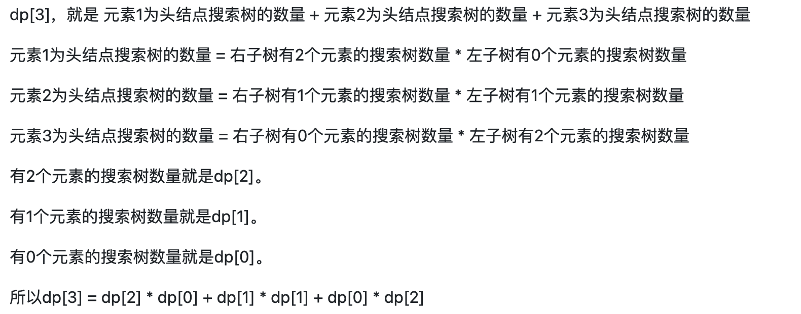

# 基础问题
[509. 斐波那契数](https://leetcode-cn.com/problems/fibonacci-number/)
```Java
class Solution {
    public int fib(int n) {
        if (n == 0) return 0;
        int[] f = new int[n + 1];
        f[0] = 0;
        f[1] = 1;
        for (int i = 2; i <= n; i++) f[i] = f[i - 1] + f[i - 2];
        return f[n];
    }
}
```
- 注意**边界情况直接输出**。

[70. 爬楼梯](https://leetcode-cn.com/problems/climbing-stairs/)
```Java
class Solution {
    public int climbStairs(int n) {
        if (n == 1) return 1;
        if (n == 2) return 2;
        int[] f = new int[n + 1];
        f[1] = 1;
        f[2] = 2;
        for (int i = 3; i <= n; i++) {
            f[i] = f[i - 1] + f[i - 2]; 
        }
        return f[n];
    }
}
```
- 注意**边界情况直接输出**。

[746. 使用最小花费爬楼梯](https://leetcode-cn.com/problems/min-cost-climbing-stairs/)
```Java
class Solution {
    public int minCostClimbingStairs(int[] cost) {
        int[] f = new int[cost.length + 1];
        for (int i = 2; i < f.length; i++) {
            f[i] = Math.min(f[i - 1] + cost[i - 1], f[i - 2] + cost[i - 2]);
        }
        return f[cost.length];
    }
}
```
- [70. 爬楼梯](https://leetcode-cn.com/problems/climbing-stairs/) 的变形。

[62. 不同路径](https://leetcode-cn.com/problems/unique-paths/)
```Java
class Solution {
    public int uniquePaths(int m, int n) {
        int[][] f = new int[m][n];
        f[0][0] = 1;
        for (int i = 0; i < m; i++) {
            for (int j = 0; j < n; j++) {
                if (i > 0) f[i][j] += f[i - 1][j];
                if (j > 0) f[i][j] += f[i][j - 1];
            }
        }
        return f[m - 1][n - 1];
    }
}
```
- f[i][j] 表示从 (0, 0) 到 (i, j) 有多少条路径。

[63. 不同路径 II](https://leetcode-cn.com/problems/unique-paths-ii/)
```Java
class Solution {
    public int uniquePathsWithObstacles(int[][] obstacleGrid) {
        int m = obstacleGrid.length, n = obstacleGrid[0].length;
        int[][] f = new int[m][n];
        f[0][0] = 1;
        for (int i = 0; i < m; i++) {
            for (int j = 0; j < n; j++) {
                if (obstacleGrid[i][j] == 1) {
                    f[i][j] = 0;
                    continue;
                }
                if (i > 0) f[i][j] += f[i - 1][j];
                if (j > 0) f[i][j] += f[i][j - 1];
            }
        }
        return f[m - 1][n - 1];
    }
}
```
- 加上障碍物只需要将到障碍物的方法数设置为 0 即可。

[343. 整数拆分](https://leetcode-cn.com/problems/integer-break/)
```Java
class Solution {
    public int integerBreak(int n) {
        // 题目中提到了 n >= 2
        int[] f = new int[n + 1]; 
        // f[2] = max(f[1] * 1, 1 * 1) 也是满足迭代公式的，不需要初始化
        for (int i = 2; i <= n; i++) {
            for (int j = 1; j < i; j++) {
                f[i] = Math.max(f[i], Math.max(f[i - j] * j, (i - j) * j));
            }
        }
        return f[n];
    }
}
```
- f[i] 是将 i **拆分**成**正整数**后，其积的最大值。
- 注意 f[i] 中存的**一定是要将 i 拆分**的，而对于 f[k] （k > i），有可能 i * (k - i) > f[i] * (k - i)，所以转移公式如上。
    - 例如: f[2] = 1, 2 > f[2]。

[96. 不同的二叉搜索树](https://leetcode-cn.com/problems/unique-binary-search-trees/)
```Java
class Solution {
    public int numTrees(int n) {
        int[] f = new int[n + 1];
        f[0] = 1;
        for (int i = 1; i <= n; i++) {
            for (int j = i - 1; j >= 0; j--) {
                f[i] += f[j] * f[i - 1 - j];
            }
        }
        return f[n];
    }
}
```
- 

# 背包问题
## 01背包
[分割等和子集](https://leetcode-cn.com/problems/partition-equal-subset-sum/)
```Java
class Solution {
    public boolean canPartition(int[] nums) {
        int n = nums.length;
        int sum = 0;
        int[] w = new int[nums.length + 1], v = new int[nums.length + 1];
        for (int i = 0; i < nums.length; i++) {
            sum += nums[i];
            w[i + 1] = nums[i];
            v[i + 1] = nums[i];
        }
        if (sum % 2 != 0) return false;
        return zeroOneBag(v, w, n, sum / 2) == sum / 2;
    }
    private int zeroOneBag(int[] v, int[] w, int n, int m) {
        int[] f = new int[m + 1];
        for (int i = 1; i <= n; i++) {
            for (int j = m; j >= v[i]; j--) {
                f[j] = Math.max(f[j], f[j - v[i]] + w[i]);
            }
        }
        return f[m];
    }
}
```

- 物品的**体积**和**价值**都对应 nums 中的元素值。
- 背包的容积对应 **sum/2**。
- f[i][j] 表示使用前 i 个元素, 体积 <= j 的最大价值，因为体积和价值都是 nums 中的元素值，所以**最大价值顶多为 j**。

[1049. 最后一块石头的重量II](https://leetcode-cn.com/problems/last-stone-weight-ii/)

```Java
class Solution {
    public int lastStoneWeightII(int[] stones) {
        int sum = 0;
        int[] v = new int[stones.length + 1], w = new int[stones.length + 1];
        for (int i = 0; i < stones.length; i++) {
            sum += stones[i];
            v[i + 1] = stones[i];
            w[i + 1] = stones[i];
        }
        int t = zeroOneBag(v, w, stones.length, sum / 2);
        return sum - 2 * t;
    }
    private int zeroOneBag(int[] v, int[] w, int n, int m) {
        int[] f = new int[m + 1];
        for (int i = 1; i <= n; i++) {
            for (int j = m; j >= v[i]; j--) {
                f[j] = Math.max(f[j], f[j - v[i]] + w[i]);
            }
        }
        return f[m];
    }
}
```
- 尽量让石头**分成重量相同的两堆**，这样相撞后剩下的石头最小。
- 如此将文件转化成了**分割等和子集**的问题。

[494. 目标和](https://leetcode-cn.com/problems/target-sum/)
```Java
class Solution {
    public int findTargetSumWays(int[] nums, int target) {
        int sum = 0;
        int[] v = new int[nums.length + 1];
        for (int i = 0; i < nums.length; i++) {
            sum += nums[i];
            v[i + 1] = nums[i];
        }
        if ((sum + target) % 2 == 1) return 0;
        if (Math.abs(target) > sum) return 0;
        return zeroOneBag(v, nums.length, (sum + target) / 2);
    }
    private int zeroOneBag(int[] v, int n, int m) {
        int[] f = new int[m + 1];
        f[0] = 1; // 装满容量为 0 的背包且使用前 0 个元素的方法有 1 个，f[1 ~ m] = 0
        for (int i = 1; i <= n; i++) {
            for (int j = m; j >= v[i]; j--) {
                f[j] = f[j] + f[j - v[i]];
            }
        }
        return f[m];
    }
}
```

- 分成两部分, 一部分符号为 + 的(该部分的和为 x)，一部分为 - 的(该部分和为 sum - x)。得到 x - (sum - x) = target， 化简得到 x = (sum + target) / 2， 注意这时候 sum + target 必须为偶数，且 abs(target) < sum。
- 该题的 f[i][j] 表示使用**前 i 个数，装满容量为 j 的背包的方法有几种**。所以 f[0][0] = 1，也就是使用 0 个数，装满容量为 0 的背包的方法有 1 中。

[474. 1和0](https://leetcode-cn.com/problems/ones-and-zeroes/submissions/)

```Java
class Solution {
    public int findMaxForm(String[] strs, int m, int n) {
        int[][] f = new int[m + 1][n + 1];
        for (int i = 1; i <= strs.length; i++) {
            int zeros = numOfZero(strs[i - 1]);
            int ones = strs[i - 1].length() - zeros;
            for (int j = m; j >= zeros; j--) {
                for (int k = n; k >= ones; k--) {
                    f[j][k] = Math.max(f[j][k], f[j - zeros][k - ones] + 1);
                }
            }
        } 
        return f[m][n];
    }
    private int numOfZero(String str) {
        int cnt = 0;
        for (int i = 0; i < str.length(); i++) {
            if (str.charAt(i) == '0') cnt++;
        }
        return cnt;
    }
}
```
- 本题目背包容量是两个限制，所以增加一个维度即可。

## 完全背包
[518. 零钱兑换II](https://leetcode-cn.com/problems/coin-change-2/)

```Java
class Solution {
    public int change(int amount, int[] coins) {
        int[] v = new int[coins.length + 1];
        for (int i = 0; i < coins.length; i++) {
            v[i + 1] = coins[i];
        }
        return wholeBag(v, coins.length, amount);
    }
    // f[i][j] 表示使用前 i 种硬币，且总价值恰好为 j 的选法数目， v 从 1 开始
    // f[i][j] = f[i - 1][j] + f[i - 1][j - v] + .. f[i - 1][j - kv] 
    //         = f[i - 1][j] + f[i][j - v]
    private int wholeBag(int[] v, int n, int m) {
        int[] f = new int[m + 1];
        f[0] = 1;
        for (int i = 1; i <= n; i++) {
            for (int j = v[i]; j <= m; j++) {
                f[j] = f[j] + f[j - v[i]];
            }
        }
        return f[m];
    }
}
```

[377. 组合总和IV](https://leetcode-cn.com/problems/combination-sum-iv/)

```Java
class Solution {
    public int combinationSum4(int[] nums, int target) {
        int[] v = new int[nums.length + 1];
        for (int i = 0; i < nums.length; i++) v[i + 1] = nums[i];
        return wholeBag(v, nums.length, target);
    }
    private int wholeBag(int[] v, int n, int m) {
        int[] f = new int[m + 1];
        f[0] = 1;
        for (int j = 0; j <= m; j++) {
            for (int i = 1; i <= n; i++) {
                if (j >= v[i]) f[j] += f[j - v[i]];
            }
        }
        return f[m];
    }
}
```
- 该题目与零钱兑换很相似，唯一差别在于该题求的是**排列数**。
- 如果求**组合数**就是外层for循环遍历物品，内层for遍历背包。
- 如果求**排列数**就是外层for遍历背包，内层for循环遍历物品。

[70. 爬楼梯](https://leetcode-cn.com/problems/climbing-stairs/)

```Java
class Solution {
    public int climbStairs(int n) {
        int[] f = new int[n + 1];
        f[0] = 1;
        for (int j = 0; j <= n; j++) {
            for (int i = 1; i <= 2; i++) {
                if (j - i >= 0) f[j] += f[j - i];
            }
        }
        return f[n];
    }
}
```
- 爬楼梯的完全背包写法。

[322. 零钱兑换](https://leetcode-cn.com/problems/coin-change/)
```Java
class Solution {
    public int coinChange(int[] coins, int amount) {
        int[] v = new int[coins.length + 1];
        for (int i = 0; i < coins.length; i++) {
            v[i + 1] = coins[i];
        }
        return wholeBag(v, coins.length, amount);
    }
    private int wholeBag(int[] v, int n, int m) {
        int[] f = new int[m + 1];
        Arrays.fill(f, 0x3f3f3f3f);
        f[0] = 0;
        for (int i = 1; i <= n; i++) {
            for (int j = v[i]; j <= m; j++) {
                f[j] = Math.min(f[j], f[j - v[i]] + 1);
            }
        }
        return f[m] == 0x3f3f3f3f ? -1 : f[m];
    }
}
```
- 本题的属性是最小值，在初始化的时候要注意将 f[1~m] 初始化成 0x3f3f3f3f，f[0] = 0.

[279. 完全平方数](https://leetcode-cn.com/problems/perfect-squares/)
```Java
class Solution {
    public int numSquares(int n) {
        int i = 1;
        while (i * i <= n) i++;
        return wholeBag(i - 1, n);
    }
    private int wholeBag(int n, int m) {
        int[] f = new int[m + 1];
        Arrays.fill(f, 0x3f3f3f3f);
        f[0] = 0;
        for (int i = 1; i <= n; i++) {
            for (int j = i * i; j <= m; j++) {
                f[j] = Math.min(f[j], f[j - i * i] + 1);
            }
        }
        return f[m];
    }
}
```
- 与上题完全相同。

[139. 单词拆分](https://leetcode-cn.com/problems/word-break/)
```Java
class Solution {
    public boolean wordBreak(String s, List<String> wordDict) {
        // f[j] 表示 [0, j) 能否被字典中的前 i 个单词表示 
        boolean[] f = new boolean[s.length() + 1];
        f[0] = true;
        for (int j = 0; j <= s.length(); j++) {
            for (int i = 1; i <= wordDict.size(); i++) {
                String v = wordDict.get(i - 1); // 获取第 i 个单词
                int vLength = v.length(); // 获取第 i 个单词的长度
                if (j >= vLength) {
                    f[j] = f[j] || (f[j - vLength] && v.equals(s.substring(j - vLength, j)));
                }
            }
        }
        return f[s.length()];
    }
}
```
- 事实上，因为 substring 的过程中有考虑顺序，所以应该把物体遍历放在内层循环。

# 打家劫舍
[198. 打家劫舍](https://leetcode-cn.com/problems/house-robber/)
```Java
class Solution {
    public int rob(int[] nums) {
        int[] f = new int[nums.length + 1];
        // 因为 f[i] 跟之前的两项有关系，所以要初始化两项
        f[0] = 0;
        f[1] = nums[0];
        // f[i] 表示前 i 个屋子最多的偷窃金额
        for (int i = 2; i <= nums.length; i++) {
            f[i] = Math.max(f[i - 1], f[i - 2] + nums[i - 1]);
        }
        return f[nums.length];
    }
}
```

[213. 打家劫舍II](https://leetcode-cn.com/problems/house-robber-ii/)
```Java
class Solution {
    public int rob(int[] nums) {
        if (nums.length == 1) return nums[0];
        int[] v1 = new int[nums.length];
        int[] v2 = new int[nums.length];
        for (int i = 0; i < nums.length - 1; i++) {
            v1[i + 1] = nums[i];
        } 
        for (int i = 1; i < nums.length; i++) {
            v2[i] = nums[i];
        }
        return Math.max(helper(v1, nums.length - 1), helper(v2, nums.length - 1));
    }
    private int helper(int[] v, int n) {
        int[] f = new int[n + 1];
        f[0] = 0;
        f[1] = v[1];
        for (int i = 2; i <= n; i++) {
            f[i] = Math.max(f[i - 1], f[i - 2] + v[i]);
        }
        return f[n];
    }
}
```
- 由于 0 号房子和最后一个房子不能同时出现，所以分成两种情况分别考虑即可。

[337. 打家劫舍 III](https://leetcode-cn.com/problems/house-robber-iii/)

- 挖坑

# 股票系列
[121. 买卖股票的最佳时机I](https://leetcode-cn.com/problems/best-time-to-buy-and-sell-stock/)

```Java
class Solution {
    public int maxProfit(int[] prices) {
        int[][] f = new int[prices.length + 1][2];

        // f[i][j] 表示前 i 天结束后，且手上持股(1)/不持股(0)的最大现金
        f[0][0] = 0;
        f[0][1] = -0x3f3f3f3f;
        for (int i = 1; i <= prices.length; i++) {
            int p = prices[i - 1]; // p 是第 i 天的价格
            f[i][0] = Math.max(f[i - 1][0], f[i - 1][1] + p);
            f[i][1] = Math.max(f[i - 1][1], -p); 
        }
        return f[prices.length][0];
    }
}
```
- 优化:

```Java
class Solution {
    public int maxProfit(int[] prices) {
        int[] f = new int[2];

        // f[i][j] 表示前 i 天结束后，且手上持股(1)/不持股(0)的最大现金
        f[0] = 0;
        f[1] = -0x3f3f3f3f;
        for (int i = 1; i <= prices.length; i++) {
            int p = prices[i - 1]; // p 是第 i 天的价格
            f[0] = Math.max(f[0], f[1] + p);
            f[1] = Math.max(f[1], -p); 
        }
        return f[0];
    }
}
```
[122. 买卖股票的最佳时机II](https://leetcode-cn.com/problems/best-time-to-buy-and-sell-stock-ii/)

```Java
class Solution {
    public int maxProfit(int[] prices) {
        int[][] f = new int[prices.length + 1][2];

        // f[i][j] 表示前 i 天结束后，且手上持股(1)/不持股(0)的最大现金
        f[0][0] = 0;
        f[0][1] = -0x3f3f3f3f;
        for (int i = 1; i <= prices.length; i++) {
            int p = prices[i - 1]; // p 是第 i 天的价格
            f[i][0] = Math.max(f[i - 1][0], f[i - 1][1] + p);
            f[i][1] = Math.max(f[i - 1][1], f[i - 1][0] - p); 
        }
        return f[prices.length][0];
    }
}
```
- 优化: 注意用 tmp 存 f[i - 1][0]

```Java
class Solution {
    public int maxProfit(int[] prices) {
        int[] f = new int[2];

        // f[i][j] 表示前 i 天结束后，且手上持股(1)/不持股(0)的最大现金
        f[0] = 0;
        f[1] = -0x3f3f3f3f;
        for (int i = 1; i <= prices.length; i++) {
            int p = prices[i - 1]; // p 是第 i 天的价格
            int tmp = f[0];
            f[0] = Math.max(f[0], f[1] + p);
            f[1] = Math.max(f[1], tmp - p); 
        }
        return f[0];
    }
}
```

# 子序列系列
## 子序列(不连续)
[300. 最长递增子序列](https://leetcode-cn.com/problems/longest-increasing-subsequence/)

- O(N) 解法:
```Java
class Solution {
    public int lengthOfLIS(int[] nums) {
        int[] a = new int[nums.length + 1];
        // src, srcPos, dest, destPos, length
        System.arraycopy(nums, 0, a, 1, nums.length);
        int[] f = new int[nums.length + 1];
        for (int i = 1; i <= nums.length; i++) {
            f[i] = 1;
            for (int j = 1; j < i; j++) {
                if (a[j] < a[i]) f[i] = Math.max(f[i], f[j] + 1); 
            }
        }
        
        // 注意最长递增子序列最关键的是该结果可能出现在以任何元素结尾的序列中，所以要遍历一下所有的
        int res = 0;
        for (int i = 1; i <= nums.length; i++) {
            res = Math.max(res, f[i]);
        }
        return res;
    }
}
```
- 为了方便起见，我们将 nums 复制到 a 中，并且从 **1** 开始。
- f[i] 表示以 a[i] 结尾的**最长**递增子序列的长度。
- 那么以 a[i] 结尾的最长递增子序列的前一个元素可以是：
    - 没有：也就是仅包含 a[i]
    - a[1]：也就是从 f[1] 转移过来，长度为 f[1] + 1
    - a[2]：也就是从 f[2] 转移过来，长度为 f[2] + 1
    ...
    - a[i - 1]：也就是从 f[i - 1] 转移过来，长度为 f[i - 1] + 1
- f[i] 求上述所有情况的**最大值**即可。
- **注意最长递增子序列最关键的是该结果可能出现在以任何元素结尾的序列中，所以要遍历一下所有的f[i]**

[1143. 最长公共子序列](https://leetcode-cn.com/problems/longest-common-subsequence/)
```Java
class Solution {
    public int longestCommonSubsequence(String text1, String text2) {
        int[][] f = new int[text1.length() + 1][text2.length() + 1];
        for (int i = 1; i <= text1.length(); i++) {
            for (int j = 1; j <= text2.length(); j++) {
                f[i][j] = Math.max(f[i - 1][j], f[i][j - 1]);
                if (text1.charAt(i - 1) == text2.charAt(j - 1)) {
                    f[i][j] = Math.max(f[i][j], f[i - 1][j - 1] + 1);
                }
            }
        }
        return f[text1.length()][text2.length()];
    }
}
```


- 注意：f[i - 1, j] 表示的是所有在第一个序列的前 i - 1 个字母中出现，在第二个序列的前 j 个字母中出现的子序列。而我们的情况 01 要一定包含第二个子序列的第 j 个元素，所以不是完全等价的。但是 f[i - 1, j] 是包含情况 01 的。因为 f[i - 1][j], f[i][j - 1] 包含了情况 00，所以 00 可以不需要写出来。

[1035. 不相交的线](https://leetcode-cn.com/problems/uncrossed-lines/)

```Java
class Solution {
    public int maxUncrossedLines(int[] nums1, int[] nums2) {
        int n = nums1.length, m = nums2.length;
        int[][] f = new int[n + 1][m + 1];

        for (int i = 1; i <= n; i++) {
            for (int j = 1; j <= m; j++) {
                f[i][j] = Math.max(f[i - 1][j], f[i][j - 1]);
                if (nums1[i - 1] == nums2[j - 1]) f[i][j] = Math.max(f[i][j], f[i - 1][j - 1] + 1);
            }
        }
        return f[n][m];
    }
}
```
- f[i][j] 表示数组1 的前 i 个元素和数组2 的前 j 个元素可以绘制的最大连线数。
- f[i][j] 可以从三个状态转移过来:
    - f[i - 1][j]
    - f[i][j - 1]
    - f[i - 1][j - 1], 该状态要求 nums1[i] == nums2[j] (从 1 开始)


## 子序列(连续)
[674. 最长连续递增序列](https://leetcode-cn.com/problems/longest-continuous-increasing-subsequence/)
```Java
class Solution {
    public int findLengthOfLCIS(int[] nums) {
        int[] f = new int[nums.length + 1];
        f[1] = 1;

        for (int i = 2; i <= nums.length; i++) {
            f[i] = 1; // 最差情况就自己一个
            if (nums[i - 1] > nums[i - 2]) f[i] = f[i - 1] + 1; // 从前一个转移过来
        }

        int res = 0;
        for (int i = 1; i <= nums.length; i++) {
            res = Math.max(res, f[i]);
        }
        return res;
    }
}
```

- 该题与 [300. 最长递增子序列](https://leetcode-cn.com/problems/longest-increasing-subsequence/) 的区别在于该题目**要求连续**，所以对于 f[i], 要么仅包含第 i 个元素(从 1 开始)，要么是从 f[i - 1] 转移过来的。

[718. 最长重复子数组](https://leetcode-cn.com/problems/maximum-length-of-repeated-subarray/)

```Java
class Solution {
    public int findLength(int[] nums1, int[] nums2) {
        int n = nums1.length, m = nums2.length;
        int[][] f = new int[n + 1][m + 1];
        int ans = 0;
        for (int i = 1; i <= n; i++) {
            for (int j = 1; j <= m; j++) {
                if (nums1[i - 1] == nums2[j - 1]) f[i][j] = f[i - 1][j - 1] + 1;
                ans = Math.max(ans, f[i][j]);
            }
        }
        return ans;
    }
}
```
- 该题目与 [1143. 最长公共子序列](https://leetcode-cn.com/problems/longest-common-subsequence/) 的区别在于**子数组是连续的**。
- 这时使用 [1143. 最长公共子序列](https://leetcode-cn.com/problems/longest-common-subsequence/) 的状态定义方式就不行了，因为我们**没法保证前一个元素跟当前元素是连续的**。
- 如此，f[i][j] 表示以 nums1[i]（从 1 开始）结尾，nums2[j] （从 1 开始）结尾的最长公共子数组的长度。


[53. 最大子数组和](https://leetcode-cn.com/problems/maximum-subarray/)
```Java
class Solution {
    public int maxSubArray(int[] nums) {
        int[] f = new int[nums.length + 1];
        f[1] = nums[0];

        int res = f[1];
        for (int i = 2; i <= nums.length; i++) {
            f[i] = nums[i - 1]; // 要么是自己一个
            f[i] = Math.max(f[i], f[i - 1] + nums[i - 1]); // 要么从前面转移过来
            res = Math.max(res, f[i]);
        }
        return res;
    }
}
```

- 类似的，f[i] 为**以 nums[i]（从 1 开始）结尾**的连续子数组的最大和。
- f[i] 要么就仅仅有 nums[i], 要么从 f[i - 1] 转移过来。


## 编辑距离
[392. 判断子序列](https://leetcode-cn.com/problems/is-subsequence/)
```Java
class Solution {
    public boolean isSubsequence(String s, String t) {
        int n = s.length(), m = t.length();
        boolean[][] f = new boolean[n + 1][m + 1];
        for (int j = 0; j <= m; j++) f[0][j] = true;
        for (int i = 1; i <= n; i++) {
            for (int j = 1; j <= m; j++) {
                f[i][j] = f[i][j - 1];
                if (s.charAt(i - 1) == t.charAt(j - 1)) f[i][j] = f[i][j] || f[i - 1][j - 1];
            }
        }
        return f[n][m];
    }
}
```
- f[i][j] 表示 s 的前 i 个字符是否是 t 的前 j 个字符的子序列。
- 后续挑战:
    - 如果有大量输入的 S，称作 S1, S2, ... , Sk 其中 k >= 10 亿，你需要依次检查它们是否为 T 的子序列。在这种情况下，你会怎样改变代码？

```Java
//进阶问题的解决 
public boolean isSubsequence(String s, String t) {

    //考虑到  对第一个字符的处理 ，在t 之前一个空字符
    t=' '+t;

    //对t长字符串 做预处理
    int[][] dp = new int[t.length()][26];//存储每一个位置上  a--z的下一个字符出现的位置
    for (char c = 'a'; c <= 'z'; c++) {//依次对每个字符作处理
        int nextPos = -1;//表示接下来不会在出现该字符

        for (int i = t.length() - 1; i >= 0; i--) {//从最后一位开始处理
            dp[i][c - 'a'] = nextPos;//dp[i][c-'a']  加上外层循环  就是对每一个位置的a---z字符的处理了
            if (t.charAt(i) == c) {//表示当前位置有该字符  那么指向下一个该字符出现的位置就要被更新  为i
                nextPos = i;
            }
        }
    }

    //数据的利用 ，开始匹配
    int index=0;
    for (char c:s.toCharArray()){
        index=dp[index][c-'a'];//因为加了' '，所以之后在处理第一个字符的时候  如果是在第一行，就会去第一行，不影响之后字符的判断
        if(index==-1){
            return false;
        }
    }
    return true;
}
```

[115. 不同的子序列](https://leetcode-cn.com/problems/distinct-subsequences/)

```Java
class Solution {
    public int numDistinct(String s, String t) {
        int n = t.length(), m = s.length();
        int[][] f = new int[n + 1][m + 1];
        
        for (int j = 0; j <= m; j++) {
            f[0][j] = 1;
        }

        for (int i = 1; i <= n; i++) {
            for (int j = 1; j <= m; j++) {
                f[i][j] = f[i][j - 1];
                if (t.charAt(i - 1) == s.charAt(j - 1)) {
                    f[i][j] = f[i][j - 1] + f[i - 1][j - 1];
                }
            }
        }
        return f[n][m];
    }
}
```

- f[i][j] 表示 t 的前 i 个字符在 s 的前 j 个字符的子序列中出现的次数。
- 求出现的次数进行分类的时候，一般考虑 t[i] 和 s[j] (从 1 开始) 是否相等
    - t[i] == s[j]:
        - 使用 s[j]: f[i - 1][j - 1]
        - **不使用** s[j]: f[i][j - 1]
    - t[i] != s[j]:
        - f[i][j - 1]
- **初始化**: f[0][j] = 1, 空串在 s[0~j] 中出现的次数为 1。（边界情况）

[583. 两个字符串的删除操作](https://leetcode-cn.com/problems/delete-operation-for-two-strings/)

```Java
class Solution {
    public int minDistance(String word1, String word2) {
        int n = word1.length(), m = word2.length();
        int[][] f = new int[n + 1][m + 1];
        for (int i = 1; i <= n; i++) f[i][0] = i;
        for (int j = 1; j <= m; j++) f[0][j] = j;

        for (int i = 1; i <= n; i++) {
            for (int j = 1; j <= m; j++) {
                f[i][j] = Math.min(f[i - 1][j] + 1, f[i][j - 1] + 1);
                if (word1.charAt(i - 1) == word2.charAt(j - 1)) {
                    f[i][j] = Math.min(f[i][j], f[i - 1][j - 1]);
                }
            }
        }
        return f[n][m];
    }
}
```

- f[i][j] 表示 word1 的前 i 个字符转化成 word2 的前 j 个字符所要的最少操作数。
- 以 word1[i] == word2[j] 进行分类:（下标从 1 开始）
    - word1[i] != word2[j]:
        - f[i - 1][j] + 1: 需要删除一个元素
        - f[i][j - 1] + 1: 需要删除一个元素
    - word1[i] = word2[j]:
        - f[i - 1][j - 1], 不需要删除元素

[72. 编辑距离](https://leetcode-cn.com/problems/edit-distance/)
```Java
class Solution {
    public int minDistance(String word1, String word2) {
        int n = word1.length(), m = word2.length();
        int[][] f = new int[n + 1][m + 1];

        for (int i = 1; i <= n; i++) f[i][0] = i;
        for (int j = 1; j <= m; j++) f[0][j] = j;

        // f[0][0] = 0

        for (int i = 1; i <= n; i++) {
            for (int j = 1; j <= m; j++) {
                f[i][j] = Math.min(f[i - 1][j] + 1, f[i][j - 1] + 1);
                if (word1.charAt(i - 1) == word2.charAt(j - 1)) {
                    f[i][j] = Math.min(f[i][j], f[i - 1][j - 1]);
                } else {
                    f[i][j] = Math.min(f[i][j], f[i - 1][j - 1] + 1);
                } 
            }
        }
        return f[n][m];
    }
}
```
- f[i][j] 表示 word1 的前 i 个字符转化成 word2 的前 j 个字符所需的最少操作数。
- word1[i] == word2[j] 进行分类:
    - word1[i] != word2[j]
        - f[i - 1][j] + 1: word1 的前 i - 1个字符已经可以表示 word2 的前 j 个字符了，删除 word1[i] 即可(下标从 1 开始)，消耗一个删除操作。
        - f[i][j - 1] + 1: word1 的前 i 个字符转化成了 word2 的前 j - 1 个字符，那么需要插入 word2[j]，消耗一个插入操作。
        - f[i - 1][j - 1]: 消耗一个转化操作。
    - word1[i] == word2[j]
        - f[i - 1][j - 1]: word1 的前 i - 1 个字符转化成了 word2 的前 j - 1 个字符，无需消耗转化操作
- 初始化: f[0][j] = j（需要插入 j 次）, f[i][0] （需要删除 i 次）

## 回文
[647. 回文子串](https://leetcode-cn.com/problems/palindromic-substrings/)

```Java
class Solution {
    public int countSubstrings(String s) {
        boolean[][] f = new boolean[s.length()][s.length()];
        int res = 0;
        for (int i = s.length() - 1; i >= 0; i--) {
            for (int j = i; j < s.length(); j++) {
                if (i == j) {
                    f[i][j] = true;
                    res++;
                } else if (j - i == 1) {
                    if (s.charAt(i) == s.charAt(j)) {
                        f[i][j] = true;
                        res++;
                    }
                } else {
                    if (s.charAt(i) == s.charAt(j) && f[i + 1][j - 1]) {
                        f[i][j] = true;
                        res++;
                    }
                }
            }
        }
        return res;
    }
}
```
- f[i][j] 定义为 s[i ~ j] **是否是回文串**。有三种情况:
    - i == j, f[i][j] 一定是回文串
    - j - i == 1, 需要检查 s[i] 是否等于 s[j]
    - j - i > 1, 需要检查 s[i] 是否等于 s[j], 以及 f[i + 1][j - 1]
- 本题目的另一个难点是更新 f[i][j] 的过程中使用到了 f[i + 1][j - 1]，所以需要**从下向上，从左向右**更新。

[516. 最长回文子序列](https://leetcode-cn.com/problems/longest-palindromic-subsequence/)
```Java
class Solution {
    public int longestPalindromeSubseq(String s) {
        int[][] f = new int[s.length()][s.length()];
        for (int i = s.length() - 1; i >= 0; i--) {
            for (int j = i; j < s.length(); j++) {
                if (i == j) {
                    f[i][j] = 1;
                } else if (s.charAt(i) == s.charAt(j)) { 
                    // 注意当 j - i == 1 时候 第一项 f[i + 1][j - 1]本应当为 0，在矩阵初始化的时候刚好为 0，所以不需要特殊判断
                    f[i][j] = f[i + 1][j - 1] + 2;
                } else {  // s.charAt(i) != s.charAt(j)
                    f[i][j] = Math.max(f[i + 1][j], f[i][j - 1]);
                }
            }
        }
        return f[0][s.length() - 1];
    }
}
```

- f[i][j] 表示 s[i ~ j] 内最长的回文子序列的长度。本题与 [647. 回文子串](https://leetcode-cn.com/problems/palindromic-substrings/) 的区别在于**子序列可以不连续**。
- f[i][j] 的转移过程:
    - i == j 时: f[i][j] = 1
    - j - i == 1 时:
        - s[i] == s[j]: f[i][j] = 2
        - s[i] != s[j]: f[i][j] = 1
    - j - i > 1 时:
        - s[i] == s[j]: f[i][j] = f[i + 1][j - 1] + 2
        - s[i] != s[j]: f[i][j] = max(f[i + 1][j], f[i][j - 1])
- 注意计算的时候还是**从下到上，从左到右**。
      


