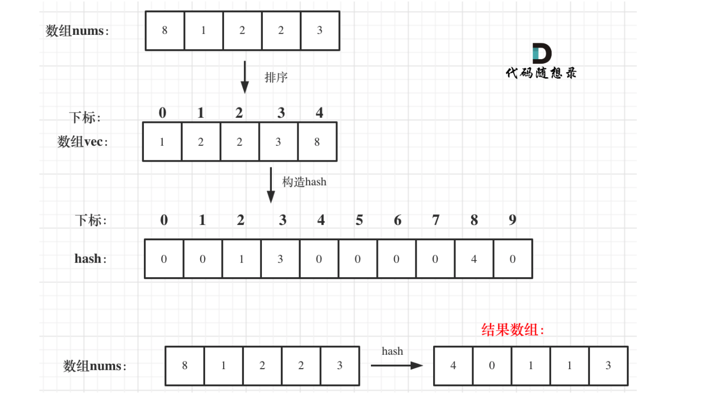

# 哈希表
## 题目
### 242. 有效的字母异位词
- 空间换时间。
- 用数组做hash table，该题目中只有小写字母。
```Java
class Solution {
    public boolean isAnagram(String s, String t) {
        if (s.length() != t.length()) return false;
        int[] hash = new int[26];
        for (char c : s.toCharArray()) {
            hash[c - 'a']++;
        }
        for (char c : t.toCharArray()) {
            hash[c - 'a']--;
            if (hash[c - 'a'] < 0) return false;
        }
        return true;
    }
}
```

### 1002. 查找共用字符
给你一个字符串数组 words ，请你找出所有在 words 的每个字符串中都出现的共用字符（ 包括重复字符），并以数组形式返回。你可以按 任意顺序 返回答案。
 

示例 1：

输入：words = ["bella","label","roller"]
输出：["e","l","l"]
示例 2：

输入：words = ["cool","lock","cook"]
输出：["c","o"]
 

提示：

1 <= words.length <= 100
1 <= words[i].length <= 100
words[i] 由小写英文字母组成
```Java
class Solution {
    public List<String> commonChars(String[] words) {
        int[] hash = new int[26];
        Arrays.fill(hash, 101);  // 1 <= word[i].length <= 100

        for (String s : words) {
            int[] tmp = new int[26];
            for (char c : s.toCharArray()) {
                tmp[c - 'a']++;
            }

            for (int i = 0; i < 26; i++) {
                hash[i] = Math.min(hash[i], tmp[i]);
            }
        }

        List<String> res = new ArrayList<>();
        for (int i = 0; i < hash.length; i++) {
            while (hash[i] > 0) {
                res.add(String.valueOf((char) (i + 'a')));  // the String representation of a char
                hash[i]--;
            }
        }
        return res;
    }
}
```
### 349. 两个数组的交集
- 利用 hashset 去重
```Java
 class Solution {
    public int[] intersection(int[] nums1, int[] nums2) {
        if (nums1 == null || nums1.length == 0 || nums2 == null || nums2.length == 0) {
            return new int[0];
        }
        HashSet<Integer> set1 = new HashSet<>();
        HashSet<Integer> resSet = new HashSet<>();
        for (int i : nums1) {
            set1.add(i);
        }
        for (int j : nums2) {
            if (set1.contains(j)) {
                resSet.add(j);
            }
        }
        int[] resArray = new int[resSet.size()];
        int index = 0;
        for (int i : resSet) {
            resArray[index++] = i;
        }
        return resArray;
    }
}
```

### 202. 快乐数
「快乐数」定义为：

对于一个正整数，每一次将该数替换为它每个位置上的数字的平方和。
然后重复这个过程直到这个数变为 1，也可能是 无限循环 但始终变不到 1。
如果 可以变为  1，那么这个数就是快乐数。
如果 n 是快乐数就返回 true ；不是，则返回 false 。
```Java
class Solution {
    public boolean isHappy(int n) {
        HashSet<Integer> hashSet = new HashSet<>();
        while (n != 1 && !hashSet.contains(n)) {
            hashSet.add(n);
            n = squaredSum(n);
        }
        return n == 1;
    }
    private int squaredSum(int n) {
        int sum = 0;
        while (n > 0) {
            sum += (n % 10) * (n % 10);
            n /= 10;
        }
        return sum;
    }
}
```

### 1. 两数之和
给定一个整数数组 nums 和一个整数目标值 target，请你在该数组中找出 和为目标值 target  的那 两个 整数，并返回它们的数组下标。

你可以假设每种输入只会对应一个答案。但是，数组中同一个元素在答案里不能重复出现。

你可以按任意顺序返回答案。

 

示例 1：

输入：nums = [2,7,11,15], target = 9
输出：[0,1]
解释：因为 nums[0] + nums[1] == 9 ，返回 [0, 1] 。
示例 2：

输入：nums = [3,2,4], target = 6
输出：[1,2]
示例 3：

输入：nums = [3,3], target = 6
输出：[0,1]

```Java
class Solution {
    public int[] twoSum(int[] nums, int target) {
        int[] res = new int[2];
        HashMap<Integer, Integer> hashMap = new HashMap<>();
        for (int i = 0; i < nums.length; i++) {
            int tmp = target - nums[i];
            if (hashMap.containsKey(tmp)) {
                res[0] = hashMap.get(tmp);
                res[1] = i;
                break;
            }
            hashMap.put(nums[i], i);
        }
        return res;
    }
}
```

### 454. 四数相加 II
给定四个包含整数的数组列表 A , B , C , D ,计算有多少个元组 (i, j, k, l) ，使得 A[i] + B[j] + C[k] + D[l] = 0。

为了使问题简单化，所有的 A, B, C, D 具有相同的长度 N，且 0 ≤ N ≤ 500 。所有整数的范围在 -228 到 228 - 1 之间，最终结果不会超过 231 - 1 。

例如:

输入:
A = [ 1, 2]
B = [-2,-1]
C = [-1, 2]
D = [ 0, 2]

输出:
2

解释:
两个元组如下:
1. (0, 0, 0, 1) -> A[0] + B[0] + C[0] + D[1] = 1 + (-2) + (-1) + 2 = 0
2. (1, 1, 0, 0) -> A[1] + B[1] + C[0] + D[0] = 2 + (-1) + (-1) + 0 = 0

```Java
class Solution {
    public int fourSumCount(int[] nums1, int[] nums2, int[] nums3, int[] nums4) {
        HashMap<Integer, Integer> hashMap = new HashMap<>();
        int res = 0;
        // 先计算nums1 和 nums2 出现的和，以及和出现的次数
        for (int i : nums1) {
            for (int j : nums2) {
                int tmp = i + j;
                hashMap.put(tmp, hashMap.getOrDefault(tmp, 0) + 1);
            }
        }
        // 看nums3 和 nums3 中有没有满足条件的，有得话 res + map.get(tmp)
        for (int i : nums3) {
            for (int j : nums4) {
                int tmp = 0 - (i + j);
                if (hashMap.containsKey(tmp)) res += hashMap.get(tmp);
            }
        }
        return res;
    }
}
```

### 383. 赎金信
给定一个赎金信 (ransom) 字符串和一个杂志(magazine)字符串，判断第一个字符串 ransom 能不能由第二个字符串 magazines 里面的字符构成。如果可以构成，返回 true ；否则返回 false。

(题目说明：为了不暴露赎金信字迹，要从杂志上搜索各个需要的字母，组成单词来表达意思。杂志字符串中的每个字符只能在赎金信字符串中使用一次。)

```Java
class Solution {
    public boolean canConstruct(String ransomNote, String magazine) {
        if (magazine.length() < ransomNote.length()) return false;
        // 适用数组构建 magazine 的 hash table
        int[] hash = new int[26];
        for (char c : magazine.toCharArray()) {
            hash[c - 'a']++;
        }
        for (char c : ransomNote.toCharArray()) {
            hash[c - 'a']--;
            if (hash[c - 'a'] < 0) return false;
        }
        return true;
    }
}
```

[1365. 有多少小于当前数字的数字](https://leetcode-cn.com/problems/how-many-numbers-are-smaller-than-the-current-number/)
```Java
class Solution {
    public int[] smallerNumbersThanCurrent(int[] nums) {
        int[] newNums = new int[nums.length];
        System.arraycopy(nums, 0, newNums, 0, nums.length);
        Arrays.sort(newNums);

        int[] hash = new int[110];
        for (int i = newNums.length - 1; i >= 0; i--) {
            hash[newNums[i]] = i;
        }
        for (int i = 0; i < nums.length; i++) {
            newNums[i] = hash[nums[i]];
        }
        return newNums;
    }
}
```
- 数组哈希。
- 为了让相同的元素输出最前面的 index，采用**从后向前**遍历。




[1207. 独一无二的出现次数](https://leetcode-cn.com/problems/unique-number-of-occurrences/)
```Java
class Solution {
    public boolean uniqueOccurrences(int[] arr) {
        Map<Integer, Integer> map = new HashMap<>();
        for (int a : arr) {
            map.put(a, map.getOrDefault(a, 0) + 1);
        }
        Set<Integer> set = new HashSet<>();
        for (int key: map.keySet()) {
            if (set.contains(map.get(key))) return false;
            else set.add(map.get(key));
        }
        return true;
    }
}
```