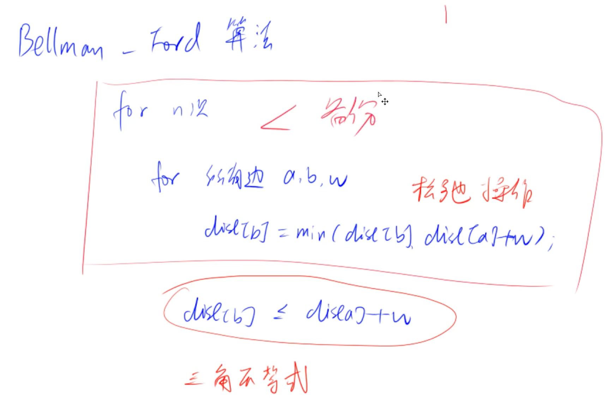

# 宽度优先搜索
## 拓扑排序
[207. 课程表](https://leetcode-cn.com/problems/course-schedule/)


```Java
class Solution {
    private int[] h, e, ne;
    private int idx;
    public boolean canFinish(int numCourses, int[][] prerequisites) {
        idx = 1;

        h = new int[numCourses];
        e = new int[5010];
        ne = new int[5010];

        Arrays.fill(h, -1);
        // d 中存放了所有课程的入度
        int[] d = new int[numCourses];
        for (int[] pre : prerequisites) {
            add(pre[1], pre[0]);
            d[pre[0]]++;
        }
        return topSort(numCourses, d);
    }
    // 头插法
    private void add(int a, int b) {
        e[idx] = b;
        ne[idx] = h[a];
        h[a] = idx++;
    }
    private boolean topSort(int numCourses, int[] d) {
        Queue<Integer> q = new LinkedList<>();
        List<Integer> res = new ArrayList<>();
        // 所有入度为 0 的点入队
        for (int i = 0; i < d.length; i++) {
            if(d[i] == 0) q.offer(i);
        }

        while (!q.isEmpty()) {
            int u = q.poll();
            res.add(u);
            for (int i = h[u]; i != -1; i = ne[i]) {
                int v = e[i];
                d[v]--;
                if (d[v] == 0) q.offer(v);
            }
        }
        return res.size() == numCourses;
    }
}
```

- 用途: conflict dependency graph。

# 最短路径
## 朴素 Dijkstra
[743. 网络延迟时间](https://leetcode-cn.com/problems/network-delay-time/)

- 适合稠密图且权值为正

```Java
class Solution {
    public int networkDelayTime(int[][] times, int n, int k) {
        int[][] g = new int[n + 1][n + 1];

        for (int[] gg: g) Arrays.fill(gg, 0x3f3f3f3f);
        for (int[] t: times) {
            g[t[0]][t[1]] = t[2];
        }
        int total = dijkstra(n, k, g);
        return total;
    }
    private int dijkstra(int n, int k, int[][] g) {
        int[] dist = new int[n + 1];
        // st[i] 表示节点 i 是否已经加入集合 S, 其中集合 S 是确定了到源点最短距离的点
        boolean[] st = new boolean[n + 1];

        Arrays.fill(dist, 0x3f3f3f3f);
        dist[k] = 0;

        // 遍历 n 次
        for (int i = 0; i < n; i++) {
            // 找不在 s 中的距离最近的点
            int t = -1;
            for (int j = 1; j <= n; j++) {
                if (!st[j] && (t == -1 || dist[j] < dist[t])) t = j;
            }

            // 将该点加入 s，并根据该点更新距离
            st[t] = true;
            for (int j = 1; j <= n; j++) {
                dist[j] = Math.min(dist[j], dist[t] + g[t][j]);
            }
        }
        int m = 0;
        for (int i = 1; i <= n; i++) {
            if (dist[i] == 0x3f3f3f3f) return -1;
            m = Math.max(dist[i], m);
        }
        return m;
    }
}
```

## Bellman-Ford
[787. K 站中转内最便宜的航班](https://leetcode-cn.com/problems/cheapest-flights-within-k-stops/)



- 可以适用于**带负权**，且有 **k 个中转点的限制**
- 注意要 backup, 防止**串联**发生
```Java
class Solution {
    public int findCheapestPrice(int n, int[][] flights, int src, int dst, int k) {
        int cheapest = bellman_ford(n, flights, src, dst, k);
        return cheapest;
    }
    private int bellman_ford(int n, int[][] flights, int src, int dst, int k) {
        int[] dist = new int[n];
        Arrays.fill(dist, 0x3f3f3f3f);
        dist[src] = 0;

        int[] backup = new int[n];

        // 迭代 k + 1 次， 因为是最多经过 k 站中转
        for (int i = 0; i <= k; i++) {
            backup = Arrays.copyOf(dist, dist.length);
            for (int[] flight: flights) {
                int a = flight[0], b = flight[1], w = flight[2];
                dist[b] = Math.min(dist[b], backup[a] + w);
            }
        }

        if (dist[dst] > 0x3f3f3f3f / 2) return -1; // 这个写的是带负权的通用情况
        return dist[dst];
    }
}
```

## SPFA
[1129. 颜色交替的最短路径](https://leetcode-cn.com/problems/shortest-path-with-alternating-colors/)

- 优化 bellman-Ford 算法: 更新过谁再用谁去更新别人。
- 可以处理无**负环**的**稀疏图**


```Java
class Solution {
    private int[] h, e, ne, color;
    private int idx;
    public int[] shortestAlternatingPaths(int n, int[][] redEdges, int[][] blueEdges) {
        h = new int[n];
        e = new int[1000];
        ne = new int[1000];
        color = new int[1000];

        idx = 1;
        Arrays.fill(h, -1);

        // 红色是 1， blue 是 2
        for (int[] red : redEdges) {
            add(red[0], red[1], 1);
        }
        for (int[] blue : blueEdges) {
            add(blue[0], blue[1], 2);
        }
        return spfa(n);
    }
    private void add(int a, int b, int c) {
        e[idx] = b;
        ne[idx] = h[a];
        color[idx] = c;
        h[a] = idx++; 
    }
    // 遍历更新过的边对应的点，而不是所有的边
    private int[] spfa(int n) {
        int[][] dist = new int[n][3];
        for (int[] d : dist) {
            Arrays.fill(d, 0x3f3f3f3f);
        }

        // dist[i][1] 中存的是到 i 且入边为红色的最短距离，dist[i][2] 中存的是到 i 且入边为蓝色的最短距离
        dist[0][1] = 0;
        dist[0][2] = 0;
        dist[0][0] = 0; // 需要单独处理起始点的情况
        
        // <节点编号，进入该节点的颜色> 0 表示没有颜色，1 表示红色，2 表示蓝色
        Queue<int[]> q = new LinkedList<>();
        q.offer(new int[]{0, 0});

        // st[i][1] 表示 i 是否在 q 中(且进入 i 为 红色的)
        // st[i][2] 表示 i 是否在 q 中(且进入 i 为 蓝色的)
        boolean[][] st = new boolean[n][3];
        st[0][1] = true;
        st[0][2] = true;

        while (!q.isEmpty()) {
            int[] pair = q.poll();
            int u = pair[0], fc = pair[1];
            if (fc == 0) {
                st[u][1] = false;
                st[u][2] = false;
            }
            st[u][fc] = false;

            for (int i = h[u]; i != -1; i = ne[i]) {
                int v = e[i], sc = color[i];
                if ((fc == 0 || sc == 3 - fc) && dist[v][sc] > dist[u][fc] + 1) {
                    dist[v][sc] = dist[u][fc] + 1;

                    if (!st[v][sc]) {
                        st[v][sc] = true;
                        q.offer(new int[]{v, sc});
                    }
                }
            }
        }
        int[] res = new int[dist.length];
        for (int i = 0; i < res.length; i++) {
            res[i] = Math.min(dist[i][1], dist[i][2]);
            if (res[i] == 0x3f3f3f3f) res[i] = -1;
        }
        return res;
    }
}
```