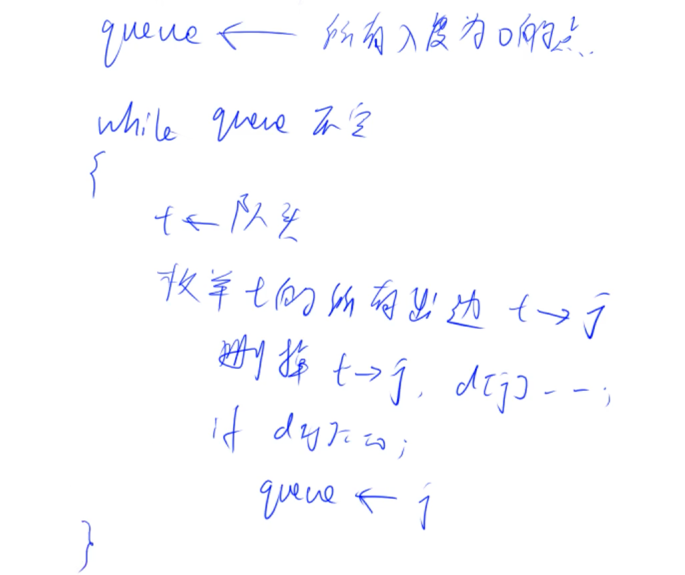

# 宽度优先搜索
## 拓扑排序
[207. 课程表](https://leetcode-cn.com/problems/course-schedule/)


```Java
class Solution {
    private int[] h, e, ne;
    private int idx;
    public boolean canFinish(int numCourses, int[][] prerequisites) {
        idx = 1;

        h = new int[numCourses];
        e = new int[5010];
        ne = new int[5010];

        Arrays.fill(h, -1);
        // d 中存放了所有课程的入度
        int[] d = new int[numCourses];
        for (int[] pre : prerequisites) {
            add(pre[1], pre[0]);
            d[pre[0]]++;
        }
        return topSort(numCourses, d);
    }
    // 头插法
    private void add(int a, int b) {
        e[idx] = b;
        ne[idx] = h[a];
        h[a] = idx++;
    }
    private boolean topSort(int numCourses, int[] d) {
        Queue<Integer> q = new LinkedList<>();
        List<Integer> res = new ArrayList<>();
        // 所有入度为 0 的点入队
        for (int i = 0; i < d.length; i++) {
            if(d[i] == 0) q.offer(i);
        }

        while (!q.isEmpty()) {
            int u = q.poll();
            res.add(u);
            for (int i = h[u]; i != -1; i = ne[i]) {
                int v = e[i];
                d[v]--;
                if (d[v] == 0) q.offer(v);
            }
        }
        return res.size() == numCourses;
    }
}
```

- 用途: conflict dependency graph。

# 最短路径
## 朴素 Dijkstra
[743. 网络延迟时间](https://leetcode-cn.com/problems/network-delay-time/)

- 适合稠密图:

```Java
class Solution {
    public int networkDelayTime(int[][] times, int n, int k) {
        int[][] g = new int[n + 1][n + 1];

        for (int[] gg: g) Arrays.fill(gg, 0x3f3f3f3f);
        for (int[] t: times) {
            g[t[0]][t[1]] = t[2];
        }
        int total = dijkstra(n, k, g);
        return total;
    }
    private int dijkstra(int n, int k, int[][] g) {
        int[] dist = new int[n + 1];
        // st[i] 表示节点 i 是否已经加入集合 S, 其中集合 S 是确定了到源点最短距离的点
        boolean[] st = new boolean[n + 1];

        Arrays.fill(dist, 0x3f3f3f3f);
        dist[k] = 0;

        // 遍历 n 次
        for (int i = 0; i < n; i++) {
            // 找不在 s 中的距离最近的点
            int t = -1;
            for (int j = 1; j <= n; j++) {
                if (!st[j] && (t == -1 || dist[j] < dist[t])) t = j;
            }

            // 将该点加入 s，并根据该点更新距离
            st[t] = true;
            for (int j = 1; j <= n; j++) {
                dist[j] = Math.min(dist[j], dist[t] + g[t][j]);
            }
        }
        int m = 0;
        for (int i = 1; i <= n; i++) {
            if (dist[i] == 0x3f3f3f3f) return -1;
            m = Math.max(dist[i], m);
        }
        return m;
    }
}
```